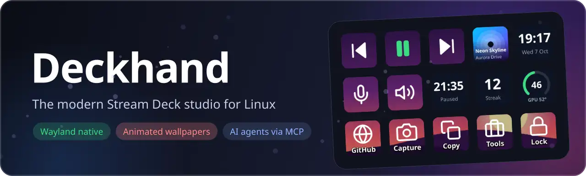
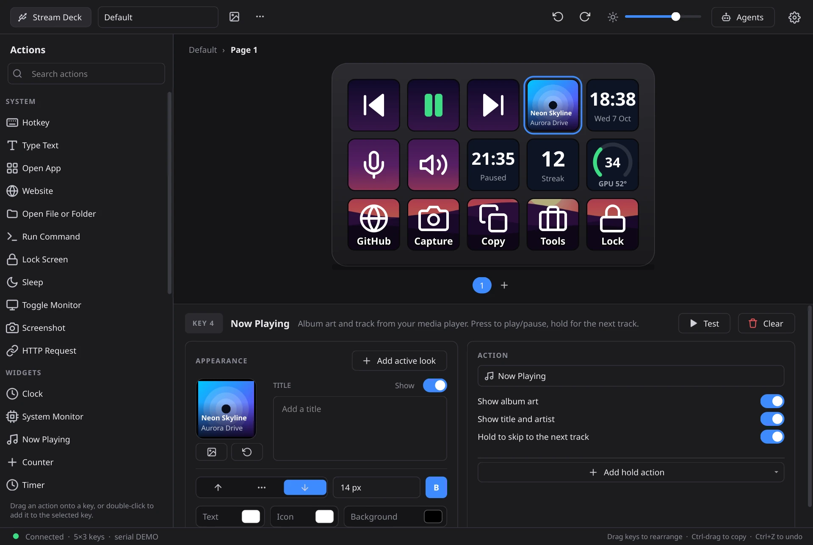
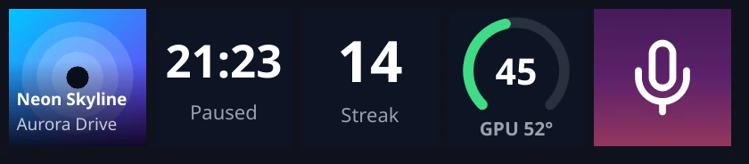
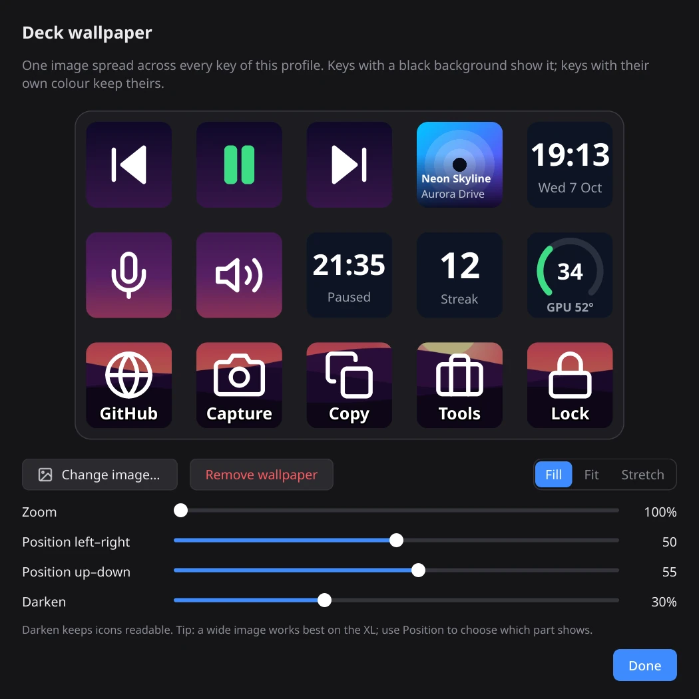
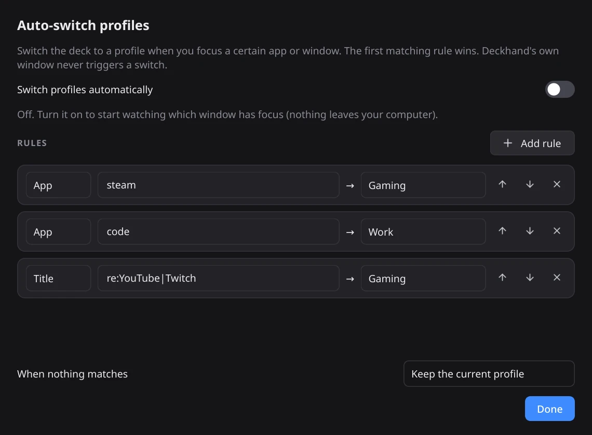
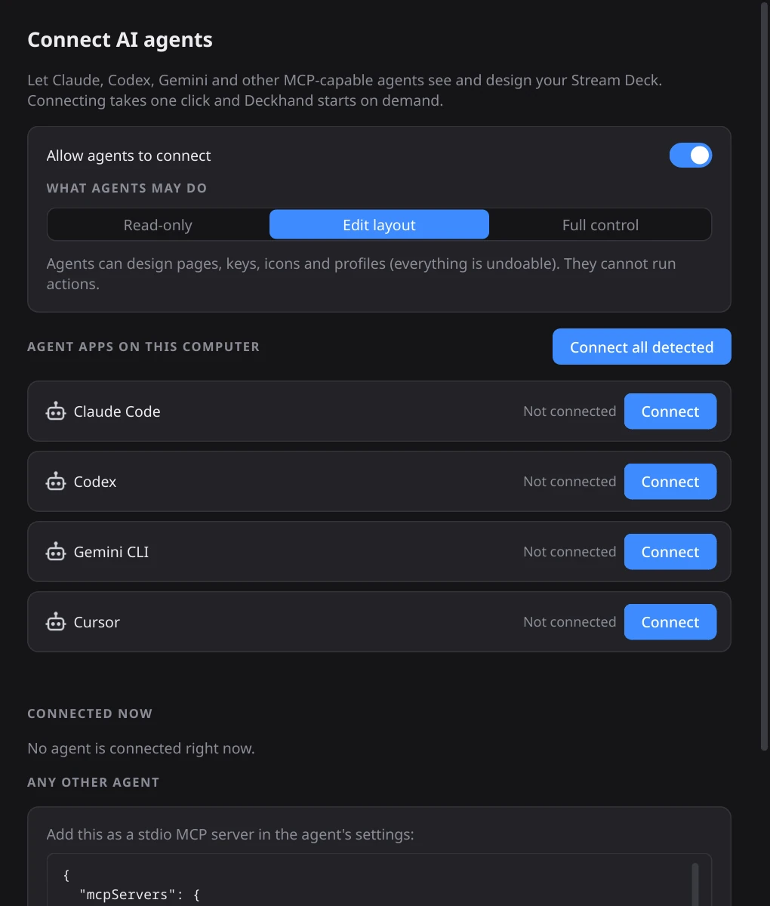
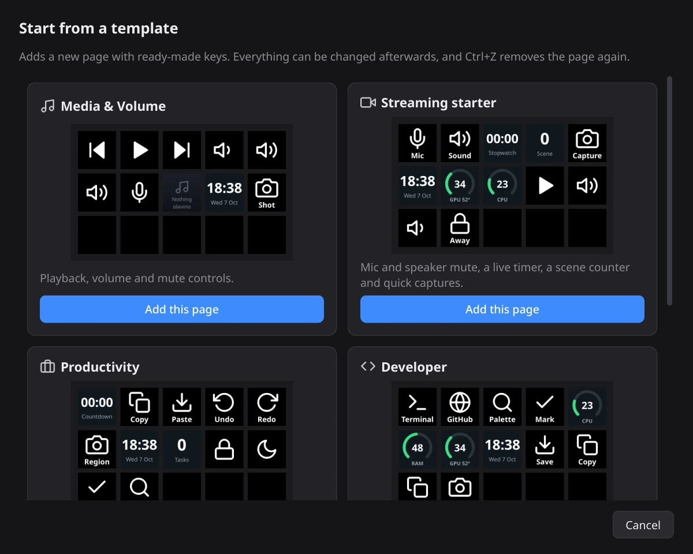
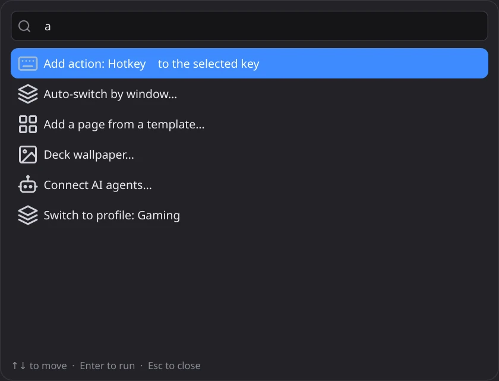

<p align="center">
  
</p>

<p align="center">
  <b>A native, no-nonsense Stream Deck editor and runtime for Linux.</b><br>
  Drag-and-drop layouts, live widgets, animated wallpapers, per-app profiles and first-class AI-agent control.
</p>

<p align="center">
  <a href="LICENSE"></a>
  
  
  
  <a href="https://github.com/ProfetGit/deckhand/actions/workflows/tests.yml"></a>
  
</p>

<p align="center">
  
</p>

---

## Why Deckhand?

Linux has Stream Deck tools, but most of them either look dated or make you fight the workflow. Deckhand is built to feel like the Windows app people love, minus the Windows: a clean three-panel editor, drag-and-drop everything, instant feedback on the real deck, and sensible behaviour when things go wrong.

- **Looks and flows like a modern desktop app.** Dark theme, purposeful micro-animations, undo/redo for everything, a command palette, no sideways scrolling.
- **Runs great on Wayland.** Keys are injected through `uinput` and window tracking uses KWin, so nothing depends on X11 tools.
- **Zero fragile dependencies.** Only PyQt6 and the `hidapi` system library. The USB driver, the MCP server and the D-Bus bridge are written in plain Python.
- **Safe by design.** Corrupt data is quarantined, never overwritten. Every edit is undoable. AI agents ask before they run anything.

## Features

### Layout and editing
- **Three-panel editor**: searchable action list, a live deck canvas, and an inspector for the selected key.
- **Drag and drop**: drop actions on keys, drag keys to rearrange (Ctrl-drag to copy), drop an image onto a key to use it as its icon, or drag a key onto a page tab to move it there.
- **Pages, folders and profiles** with import/export, duplicate, reorder and copy-between-profiles.
- **Template gallery** with ready-made pages: Media, Streaming, Productivity, Developer, System monitor.
- **Command palette (`Ctrl+K`)** to jump to any profile, page, folder, action or command.
- **Full undo/redo**, copy/paste/duplicate keys, keyboard navigation, `F1` shortcut cheat sheet.
- **Modern colour picker** (not the 1990s dialog): saturation square, hue strip, hex field, palette and recents.

### Actions
| Group | What you get |
|---|---|
| **System** | Hotkey recorder, type text, open app / file / website, run command or script, lock, sleep, screenshot, toggle monitor |
| **Network** | HTTP request (GET/POST/PUT/PATCH/DELETE with headers and body) for webhooks and smart-home |
| **Multimedia** | Play/pause, next/previous, stop, volume, mute, mic mute (optionally pinned to one device) |
| **Navigation** | Folders, page next/previous, switch profile, brightness |
| **Widgets** | Live clock, CPU / RAM / GPU gauges, **Now Playing with album art**, counter, stopwatch / countdown timer (a countdown rings a built-in chime or your own sound, then resets) |
| **Multi action** | Chain any actions with delays |

- **Hold actions**: a quick tap runs the main action, holding (configurable) runs a second one.
- **State-aware keys**: Mic Mute, Mute and Play/Pause follow the real system state (even when changed elsewhere). Any other key can get an alternate "active" look that toggles on press.

<p align="center"></p>

### Now Playing with album art
Works with any MPRIS player. **Spotify** and **YouTube Music** (desktop apps and browser tabs) are handled explicitly: low-resolution thumbnails are upgraded to full covers, YouTube video thumbnails are used as a fallback, downloads happen in the background and are cached, and a failed download never stalls the key.

### Wallpapers, including animated ones
Spread one image across the whole deck, aligned across the physical gaps between keys. Fill / Fit / Stretch, zoom, position and darken controls. **Animated GIF and WebP wallpapers** play on the deck at 5-20 fps with smart frame pacing (a slow deck drops frames instead of lagging) and bounded memory.

<p align="center"></p>

### Auto-switch profiles by active window
Map an app or a window title (plain text or `re:` regex) to a profile; the first matching rule wins. On KDE Plasma this uses a tiny KWin script that is loaded only while the feature is on, and nothing leaves your computer.

<p align="center"></p>

### AI agents (MCP) built in
Deckhand ships an [MCP](https://modelcontextprotocol.io) server so Claude, Codex, Gemini CLI, Cursor, Windsurf, VS Code, Zed, opencode and any other MCP-capable agent can design and manage your deck.

```bash
deckhand mcp install        # connects every agent app it finds, one command
```

- **34 tools**: read the layout, build pages and keys, set icons and wallpapers, manage profiles, take **screenshots** to verify their own work, undo, and more. Batch edits are a single undo step.
- **Three access levels** (Read-only, Edit layout, Full control) set in the *Agents* dialog; the default is Edit layout.
- **Approval prompts**: tools that run things on your computer (`press_key`, `run_action`) show exactly what will run and wait for your click.
- **Private by construction**: the server listens on a user-only Unix socket, nothing is exposed on the network.

<p align="center"></p>

### Reliability
- **Diagnosed device states**: not plugged in, held by another program (with a *Close it* button), missing USB permission (with the exact fix), unsupported model, missing `hidapi`. Offline editing always works and the deck is filled the moment it appears.
- **Branded loading screen** that ends as soon as the deck is found or a clear problem is known.
- **Never loses data**: corrupt files are copied aside, saves retry on failure, a daily automatic backup is kept, and Preferences has *Back up*, *Restore* (with a safety copy) and *Save diagnostics*.
- **Fail-soft rendering**: a broken key becomes a warning tile, never a crash.

### Quality of life
Night dimming schedule, idle sleep, press animation, remembered window layout, start-minimized tray mode with autostart, single-instance guard, hold-time setting, per-action friendly error messages ("'konsole' isn't installed (Arch package: konsole)").

<p align="center">
  
  
</p>

## Supported hardware

| Device | Status |
|---|---|
| Stream Deck (original V2, 15 keys) | Tested on real hardware |
| Stream Deck MK.2 (15 keys) | Supported (same protocol), not hardware-tested |
| Stream Deck XL (32 keys) | Supported (same protocol), not hardware-tested |
| Mini, Neo, Plus, Pedal | Not supported yet (different protocols) |

Multiple decks are detected; pick which one to use from the status chip.

## Install

### Requirements
- Linux with Python 3 (developed and tested on Python 3.14, CachyOS / Arch, KDE Plasma 6, Wayland)
- **PyQt6** (with QtSvg, QtNetwork and QtDBus)
- The **hidapi** system library

```bash
# Arch / CachyOS
sudo pacman -S python-pyqt6 hidapi
# Other distros: install PyQt6 (with QtSvg/QtNetwork/QtDBus) and hidapi from your package manager;
# package names vary, and only Arch has been tested.
```

### Get it

```bash
git clone https://github.com/ProfetGit/deckhand.git
cd deckhand
./scripts/install.sh        # per-user launcher, app-menu entry and icon (no root)
deckhand                    # or start it from your app menu
```

You can also run it straight from the checkout: `python3 -m deckhand`.

### One-time permissions

**USB access to the deck.** If Deckhand reports a permission problem it shows the exact fix. The rule is:

```bash
printf '%s\n' 'SUBSYSTEM=="usb", ATTRS{idVendor}=="0fd9", TAG+="uaccess"' \
              'KERNEL=="hidraw*", ATTRS{idVendor}=="0fd9", TAG+="uaccess"' \
  | sudo tee /etc/udev/rules.d/70-deckhand-streamdeck.rules >/dev/null \
  && sudo udevadm control --reload-rules && sudo udevadm trigger
```

**Sending keystrokes** (hotkeys, media keys) uses `/dev/uinput`. Preferences shows a one-line rule if it is not accessible:

```bash
echo 'KERNEL=="uinput", SUBSYSTEM=="misc", TAG+="uaccess", OPTIONS+="static_node=uinput"' \
  | sudo tee /etc/udev/rules.d/70-deckhand-uinput.rules >/dev/null \
  && sudo udevadm control --reload-rules && sudo udevadm trigger
```

> Only one program can control a Stream Deck at a time. Close the Elgato software, StreamController, streamdeck-ui or OpenDeck first; Deckhand will tell you if one of them is holding the deck.

## Usage

1. Plug in your deck and start Deckhand. The deck's keys appear in the editor.
2. Drag an action from the left panel onto a key (or double-click it to add it to the selected key).
3. Fine-tune the key in the panel below: icon, title, colours, the action's settings, an optional hold action and an optional "active" look.
4. Use `Ctrl+K` for everything else.

Closing the window keeps Deckhand running in the tray so your keys keep working; quit from the tray menu.

### Keyboard shortcuts

| Shortcut | Action |
|---|---|
| `Ctrl+K` | Command palette |
| `Ctrl+Z` / `Ctrl+Shift+Z` | Undo / redo |
| `Ctrl+C` `Ctrl+X` `Ctrl+V` | Copy, cut, paste the selected key |
| `Ctrl+D` | Duplicate the selected key |
| `Delete` | Clear the selected key |
| `Ctrl+1` to `Ctrl+9` | Go to page 1 to 9 |
| `Enter` / double-click | Open a folder (or go back) |
| `F1` | Shortcut cheat sheet |

## AI agents: setup details

```bash
deckhand mcp status         # which agent apps were found and which are connected
deckhand mcp install        # connect all detected apps (or name one: claude-code, codex, gemini, ...)
deckhand mcp uninstall      # remove it again
deckhand mcp config         # print a JSON snippet for any other agent
```

The agent's config simply starts `deckhand mcp`, a tiny stdio bridge that launches the app if needed and talks to it over a private Unix socket. Config files are merged (never overwritten) and backed up first. In the app, open *Agents* to switch access levels, see connected agents and revoke "allow for this session" approvals.

## How it works

```
deckhand/
  hardware.py     USB HID driver (ctypes over hidapi), device scan and the reconnect state machine
  engine.py       central controller: profiles, navigation, undo, device sync, key dispatch
  render.py       key renderer (one code path for the deck and the editor)
  actions.py      action registry and executors      templates.py  ready-made pages
  wallpaper.py    wallpaper slicing and animation    autoswitch.py KWin script + D-Bus bridge
  sysinfo.py      live system state (mute, MPRIS, GPU)
  agentapi.py     the agent-facing tool set          mcp_server.py MCP over a Unix socket
  mainwindow.py, widgets.py, inspector.py, ...        the Qt interface
tests/            headless test suites (UI, engine, MCP, installer, resilience, animation...)
docs/             README images and the script that regenerates them
```

Data lives in `~/.config/deckhand/` (`profiles.json`, `settings.json`, imported icons, `backups/`, `errors.log`). Profiles are plain JSON.

## Development

```bash
pip install -r requirements.txt        # PyQt6 and Pillow (tests and image generation)

python3 tests/smoke.py                 # engine, UI, drag and drop, key states
python3 tests/test_mcp.py              # MCP server end to end through the real stdio bridge
python3 tests/test_install.py          # agent installer (sandboxed HOME)
python3 tests/test_resilience.py       # corrupt data, device states, loading screen
python3 tests/test_anim.py             # animated wallpapers
python3 tests/test_autoswitch.py       # window rules and the D-Bus path
python3 tests/test_features.py         # hold actions, timers, pages, templates, backups
python3 tests/test_nowplaying.py       # Now Playing, Spotify / YouTube Music art
python3 tests/test_timer.py            # timer sound, auto-reset and custom sounds
python3 tests/test_buttons.py          # button hover glow, pointer cursor
python3 docs/make_assets.py            # regenerate the images in docs/images
```

All tests run headless (`QT_QPA_PLATFORM=offscreen`) in throwaway config directories, so they never touch your real profiles or hardware.

Contributions are welcome. Please open an issue first for larger changes, keep new actions self-contained in `actions.py` (registry entry plus executor), and add tests next to the behaviour you change.

## Troubleshooting

| Symptom | Fix |
|---|---|
| "X is using your Stream Deck" | Close that program (the banner has a *Close it* button). Disable its autostart if it keeps coming back. |
| "Not allowed to use the Stream Deck" | Install the udev rule above, then re-plug the deck. |
| Hotkeys do nothing | Install the `uinput` rule above and log out and in. |
| Auto-switch says it is unsupported | It needs KDE Plasma (KWin scripting). Everything else works on any desktop. |
| Anything else | *Preferences > Save diagnostics* and attach the file to an issue. Errors are also in `~/.config/deckhand/errors.log`. |

## Roadmap

Ideas that are not built yet: multi-select keys, a macro recorder, a screen eyedropper in the colour picker, more deck models, and window-aware switching on desktops other than KDE.

## License and notices

Released under the [MIT License](LICENSE).

Deckhand is an independent project. It is not affiliated with, endorsed by or sponsored by Elgato or Corsair. "Stream Deck" is a trademark of its respective owner and is used here only to describe compatible hardware. Spotify and YouTube Music are trademarks of their owners; Deckhand only displays cover art that your own media player publishes.
